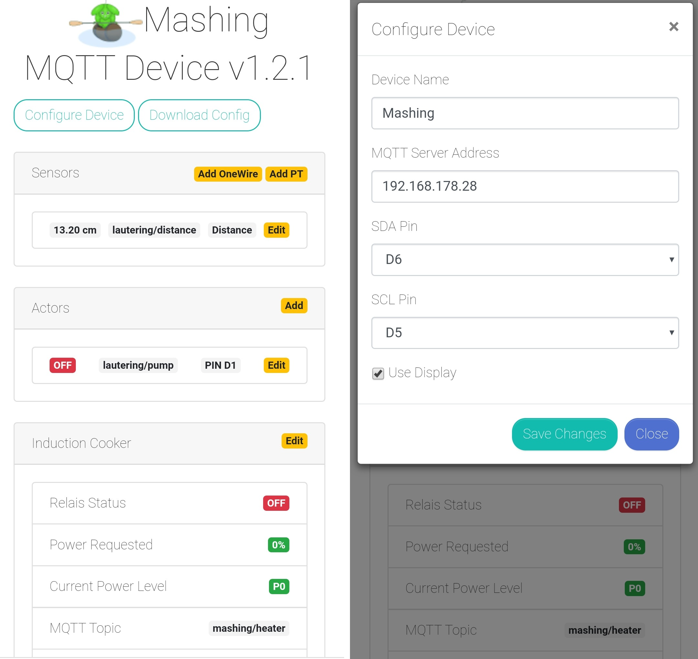

# Indebrau MQTT Controller

## Introduction

The Indebrau MQTT Controller is an Arduino sketch based on the ESP8266 to enable stable wireless communication between [CraftBeerPi V3](https://github.com/Manuel83/craftbeerpi3) with actors and sensors, based on the MQTT protocol.
It is based on the initial MQTTDevice project, started here [here](https://github.com/matschie1/MQTTDevice) and continued here [here](https://github.com/MQTTDevice/MQTTDevice).
The main feature difference is the support of the more accurate (yet a little more expensive) PT100/1000 RTD sensors, using Adafruit's "Temperature Sensor Amplifier MAX31865" sensor breakout board and library.
Additionally, it is possible to use a VL53L0X ToF distance sensor for managing the fill level of a kettle, which works great together with [this CBPi plugin](https://github.com/indebrau/cbpi-LauteringAutomation).

## Features

* Sensors
  * PT100/1000
  * OneWire
  * Distance sensor
  * Offset calibration
* Actors
  * Inverted GPIO support
  * Power percentages: If a value between 0 and 100% is sent, the ESP "pulses" with a duty cycle of 1000ms
* Induction
  * Control of a GGM induction cooker via serial communication
* Display showing the readings of a sensor (optional)
* Fully configurable (sensors, induction cooker usage, actors, host ip, display usage..) via Web interface

## Wiring, PCBs and Cases

(to come, check out the different controller repositories for (currently) undocumented 3d-print case- and pcb layouts)

## Limitations

* Display has to be 128x32 px
* Display will always show the value of the first sensor readings.

## Setup

(more to come)
